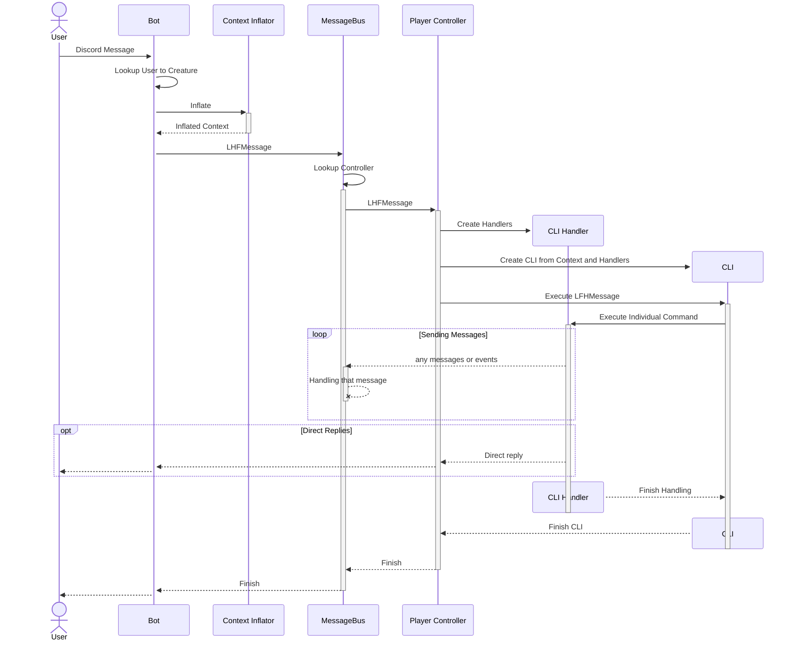

# Execution

```mermaid
sequenceDiagram
    actor User
    participant Bot
    participant Inflator as Context Inflator
    participant MessageBus
    participant PlayerController as Player Controller
    User->>+Bot: Discord Message
    Bot->>Bot: Lookup User to Creature
    Bot->>+Inflator: Inflate
    Inflator-->>-Bot: Inflated Context
    Bot->>MessageBus: LHFMessage
    MessageBus->>+MessageBus: Lookup Controller
    MessageBus->>+PlayerController: LHFMessage
    create participant CLIHandler as CLI Handler
    PlayerController->>CLIHandler: Create Handlers
    create participant CLI
    PlayerController->>CLI: Create CLI from Context and Handlers
    PlayerController->>+CLI: Execute LFHMessage
    CLI->>+CLIHandler: Execute Individual Command
    loop Sending Messages
        CLIHandler-->>+MessageBus: any messages or events
        MessageBus--x-MessageBus: Handling that message
    end
    opt Direct Replies
        CLIHandler-->>PlayerController: Direct reply
        PlayerController-->>Bot:
        Bot-->>User:
    end
    destroy CLIHandler
    CLIHandler-->>-CLI: Finish Handling
    destroy CLI
    CLI-->>-PlayerController: Finish CLI
    PlayerController-->>-MessageBus: Finish
    MessageBus-->>-Bot: Finish
    Bot-->>User:
```
